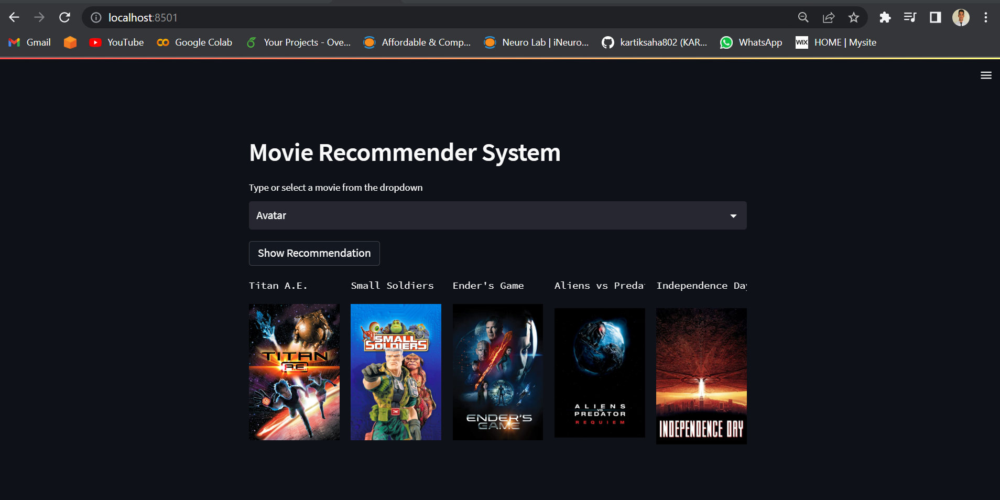

# Movie-reccomendation-Engine

Designed and developed a movie recommendation system using machine learning techniques such as cosine similarity. Utilized data  to gather movie information and user ratings to train the model. Implemented a user-friendly interface for users to input their preferences and receive personalized movie recommendations. Performed thorough evaluation of the system's performance using metrics such as precision, recall, and accuracy.
